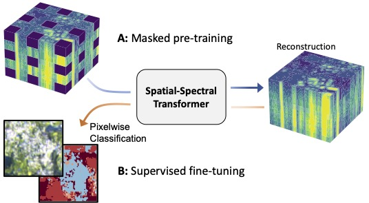

# Masked Vision Transformers for Hyperspectral Image Classification

This projects tailors vision transformers to the characteristics of hyperspectral aerial and satellite imagery using: (i) blockwise patch embeddings (ii) spatial-spectral self-attention, (iii) spectral positional embeddings and (iv) masked self-supervised pre-training.

[Results](https://openaccess.thecvf.com/content/CVPR2023W/EarthVision/html/Scheibenreif_Masked_Vision_Transformers_for_Hyperspectral_Image_Classification_CVPRW_2023_paper.html) were  presented at the CVPR EarthVision Workshop 2023 (see below for the reference).

  

# Masked pre-training
The masked pre-training can be started with a call to the `pretrain.py` file.
Before starting the training, make sure to adjust the paths to your local copy of the dataset in `configs/config.yaml`. Hyperparameters can be adjusted in `configs/pretrain_config.yaml`.

# Land-cover Classification
The `finetune.py` script can be used to finetune a pre-trained model or to train a model from scratch for classifcation of EnMAP or Houston2018 data. The desired dataset must be provided as argument, e.g., `finetune.py enmap`. Prior to training, the dataset paths must be specified in `configs/config.yaml`. Hyperparameters can be adjusted in `configs/finetune_config_{dataset}.yaml`. There is also an alternative fine-tuning script for the use with  `wandb sweep` functionality at `src/finetune_sweep.py`.

# Data
* The Houston2018 dataset is publicly [available](https://hyperspectral.ee.uh.edu/?page_id=1075) from the Hyperspectral Image Analysis Lab at the University of Houston and IEEE GRSS IADF.
* Code to re-create the unlabeled EnMAP and labeled EnMAP-DFC datasets is made available in the [enmap_data](enmap_data/) directory. Please follow the instructions there.

# Pre-trained checkpoints
We provide the pre-trained model checkpoints for the spatial-spectral transformer on Houston2018 and EnMAP datasets.
* [Houston2018 checkpoint](checkpoints/pretrained_ViTSpatialSpectral_200ep_houston2018.pth)
* [EnMAP checkpoint](checkpoints/pretrained_ViTSpatialSpectral_200ep_enmap.pth)

# Code
This repository was developed using `Python 3.8.13` with `PyTorch 1.12`. Please have a look at the `requirements.txt` file for more details.

It incorporates code from the following source for the 3D-CNN model of Li et al. (Remote Sensing, 2017)
* [DeepHyperX](https://github.com/nshaud/DeepHyperX)

The vision transformer and SimMIM implementations are adapted from:
* [vit-pytorch](https://github.com/lucidrains/vit-pytorch)

# Reference
If you would like to cite our work, please use the following reference:

* Scheibenreif, L., Mommert, M., & Borth, D. (2023). *Masked Vision Transformers for Hyperspectral Image Classification*, In Proceedings of the IEEE/CVF Conference on Computer Vision and Pattern Recognition Workshops (CVPRW) 2023 
* [Paper](https://openaccess.thecvf.com/content/CVPR2023W/EarthVision/html/Scheibenreif_Masked_Vision_Transformers_for_Hyperspectral_Image_Classification_CVPRW_2023_paper.html)
