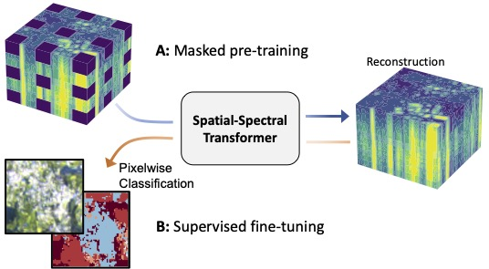

# Masked Vision Transformers for Hyperspectral Image Classification

This projects tailors vision transformers to the characteristics of hyperspectral aerial and satellite imagery using: (i) blockwise patch embeddings (ii) spatial-spectral self-attention, (iii) spectral positional embeddings and (iv) masked self-supervised pre-training.

Results will be presented at the CVPR EarthVision Workshop 2023 (see below for the reference).

  

# Masked pre-training
The masked pre-training can be started with a call to the `pretrain.py` file.
Before starting the training, make sure to adjust the paths to your local copy of the dataset in `config.yaml`. Hyperparameters can be adjusted at the top of `pretrain.py`.

# Land-cover Classification
The `finetune.py` script can be used to finetune a pre-trained model or to train a model from scratch for classifcation of EnMAP or Houston2018 data. Prior to training, the dataset paths must be specified in `config.yaml`. Hyperparameters are defined at the top of the training script.

# Data
* The Houston2018 dataset is publicly [available](https://hyperspectral.ee.uh.edu/?page_id=1075) from the Hyperspectral Image Analysis Lab at the University of Houston and IEEE GRSS IADF.
* Code to re-create the unlabeled EnMAP and labeled EnMAP-DFC datasets is made available in the [enmap_data](enmap_data/) directory. Please follow the instructions there.

# Pre-trained models
We provide the pre-trained model checkpoints for the spatial-spectral transformer on Houston2018 and EnMAP datasets.
* [SST Houston2018]()
* [SST EnMAP]()

# Code
This repository was developed using `python 3.8.13` with `pytorch 1.12`.

It incorporates code from the following source for the 3D-CNN model of Li et al. (Remote Sensing, 2017)
* [DeepHyperX](https://github.com/nshaud/DeepHyperX)

The vision transformer and SimMIM implementations are adapted from:
* [vit-pytorch](https://github.com/lucidrains/vit-pytorch)

# Reference
If you would like to cite our work, please use the following reference:

* Scheibenreif, L., Mommert, M., & Borth, D. (2023). *Masked Vision Transformers for Hyperspectral Image Classification*, In Proceedings of the IEEE/CVF Conference on Computer Vision and Pattern Recognition Workshops (CVPRW) 2023 